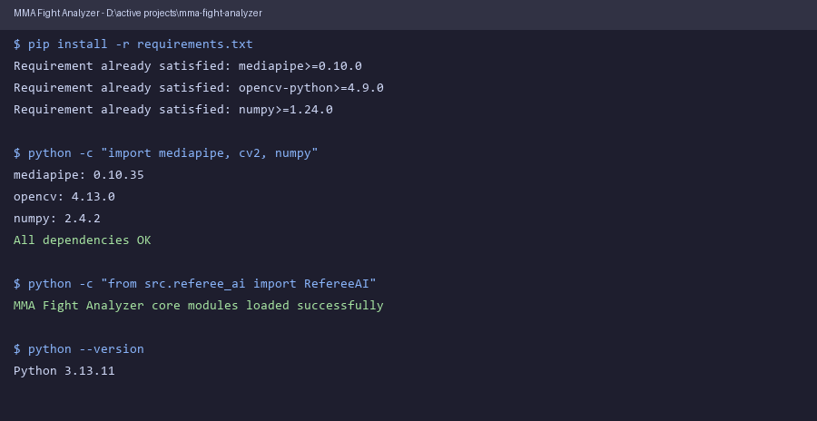

# MMA Fight Analyzer

Real-time pose-based MMA analysis with strike detection, referee AI, takedown detection, automated round management, coaching suggestions, and CSV export. **100% offline** — no cloud, no API keys, no internet.

## Features

| Module | What it does |
|--------|-------------|
| **Multi-Person Pose** | MediaPipe PoseLandmarker tracking up to 2 fighters with color-coded skeletons |
| **Strike Detection** | Per-limb buffered velocity analysis: jab, cross, hooks, uppercuts, kicks, knees |
| **Movement Analysis** | Stance (orthodox/southpaw), guard quality, forward pressure, head movement — all body-scale normalized |
| **Takedown & Clinch** | Level-change detection, hip drive analysis, clinch proximity, ground control time |
| **Referee AI** | State machine: knockdown → standup → stalling warnings, illegal strike monitoring |
| **Coaching Engine** | Real-time tips: guard position, head movement, strike variety, pressure |
| **Scoring** | MMA criteria: effective striking, aggression, round scoring |
| **Round Manager** | Auto 3x5-min rounds with rest periods, bell/horn cues, match-over detection |
| **CSV Export** | Timestamped event log: strikes, knockdowns, takedowns, round scores — exported automatically |
| **Video Analysis** | Progress bar, total frame count, per-round breakdown for fight replays |

## How It Works

```
Camera / Video File
    │
    ▼
MediaPipe PoseLandmarker (up to 2 fighters, 33 landmarks each)
    │
    ├──► Movement Analyzer    body-scale normalized metrics
    ├──► Strike Detector      per-limb buffers, N-frame window velocity
    ├──► Takedown Detector    hip drop ratio → phase machine
    ├──► Referee AI           knockdown/standup/stalling state machine
    ├──► Round Manager        5-min rounds, 1-min rest, auto-progression
    ├──► Suggestion Engine    pattern-based coaching
    └──► Export Manager       CSV with all events
    │
    ▼
OpenCV HUD: metrics panel + skeletons + round timer + progress bar
```

### Strike Detection Approach

- Each wrist/ankle has its own FIFO buffer of recent positions
- Velocity = `position(t) - position(t-N) / time` (N=2-3 frame window for smoothing)
- Movement vector dot product with shoulder-to-wrist direction = alignment score
- Classified by trajectory (forward/lateral/upward) + elbow/knee angle checks
- All thresholds normalized by shoulder width per frame (resolution-independent)

### Referee AI State Machine

```
STANDING → (nose drops >25%) → KNOCKED_DOWN → (hip rises >15%) → GETTING_UP → (nose near shoulder) → STANDING
STANDING → (no strikes for 5s) → STALLING → (strike thrown) → STANDING
```

### Takedown Detection

```
STANDING → (hip drops >25% + opponent close) → SHOOTING → (hip drops >45%) → TAKEDOWN → GROUND
STANDING → (opponent close + hip drop >10%) → CLINCH
```

## Requirements

- Python 3.9+
- Webcam (for live) or video file (for replay analysis)
- No internet during runtime

## Demo



## Install

```bash
git clone https://github.com/leonkaushikdeka/mma-fight-analyzer.git
cd mma-fight-analyzer
pip install -r requirements.txt

# MediaPipe model downloads automatically on first run
python main.py
```

## Usage

```bash
# Webcam (default, single fighter)
python main.py

# Webcam with 2-fighter multi-pose tracking
python main.py --complexity 1

# Analyze a pre-recorded fight video
python main.py --source path/to/fight.mp4

# Performance mode (process every 2nd frame)
python main.py --skip 1

# Lite model for low-end hardware
python main.py --complexity 0 --skip 2

# Heavy model for max accuracy (GPU recommended)
python main.py --complexity 2

# Custom resolution
python main.py --width 1920 --height 1080
```

### Controls

| Key | Action |
|-----|--------|
| `q` | Quit |
| `p` | Pause / Resume |
| `r` | Reset round |
| `e` | Force CSV export checkpoint |
| `+` / `=` | Increase frame skipping |
| `-` / `_` | Decrease frame skipping |

## Output

CSV export files are saved to `exports/` in the project root. Each session produces:
- `mma_fight_<timestamp>.csv` — live event log
- `mma_summary_<timestamp>.csv` — aggregated match summary

## Architecture

```
mma-fight-analyzer/
├── main.py                  Entry point
├── requirements.txt
├── README.md
├── models/                  MediaPipe models (auto-downloaded)
│   └── pose_landmarker_lite.task
├── exports/                 CSV match logs
├── src/
│   ├── main.py              Main loop, CLI, error handling
│   ├── pose_estimation.py   Multi-person MediaPipe PoseLandmarker
│   ├── movement_analyzer.py Stance, guard, pressure, head movement
│   ├── strike_detector.py   Per-limb buffered velocity analysis
│   ├── takedown_detector.py Level change, clinch, ground control
│   ├── scoring_engine.py    MMA round scoring
│   ├── referee_ai.py        Referee state machine
│   ├── suggestion_engine.py Real-time coaching
│   ├── round_manager.py     Fight timer, round progression
│   ├── export_manager.py    CSV event logging
│   └── visualizer.py        OpenCV HUD
└── data/
```

## Roadmap

- [x] Single-fighter tracking
- [x] Two-fighter tracking (MediaPipe PoseLandmarker)
- [x] Body-scale normalized metrics
- [x] Per-limb strike buffers
- [x] Referee state machine
- [x] Takedown/clinch detection
- [x] Automated round transitions
- [x] CSV match log export
- [x] Pre-recorded video analysis with progress bar
- [ ] Lightweight ML model for strike classification (~30KB)
- [ ] Real-time audio feedback (beep on knockdown)
- [ ] Jab/cross speed measurement in mph
